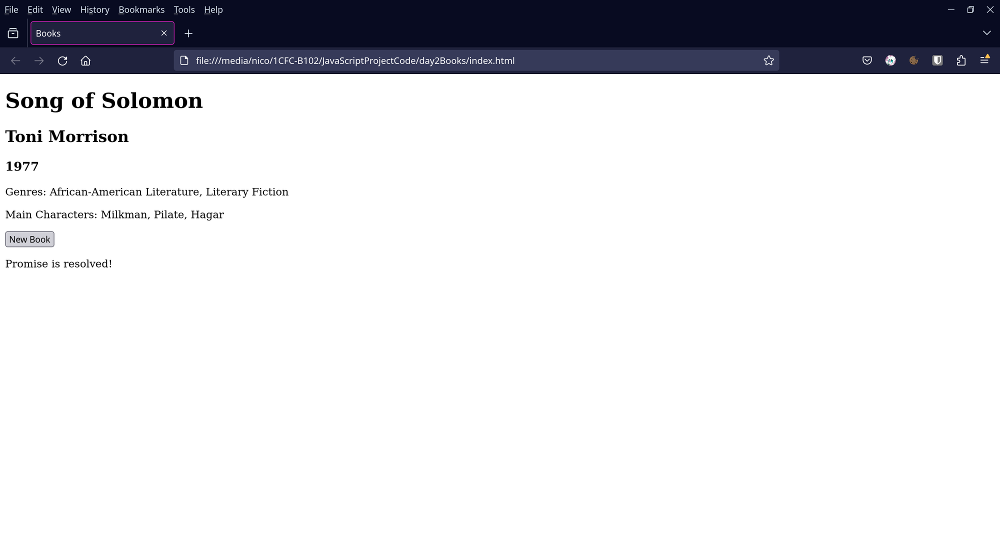

# Projects

## Day 1: The Basics

Today, dip your toes in to JavaScript by practicing the basics.

First, open your internet browser. On any webpage, right click, click Inspect on the menu, then click Console in the resulting window. Now you have a JavaScript REPL ready to go!

Take the following steps in the console:

1. Declare a variable named myName and assign it your name as a string.
2. Declare more variables:
    1. myAge - a Number representing your age in years
    2. myFirstJavaScript - a Boolean indicating whether you’re brand new to JavaScript (true) or have some experience (false)
    3. myFavoriteFruit - a String of your favorite fruit’s name
    4. myFavoriteDinosaur - a String of your favorite dinosaur’s name
3. Create an empty array named myArray. Use myArray.push() to place all of the variables you’ve created into it.
4. Create a new array called stringArray. Use myArray.map() to apply toString() to each element of myArray, and assign the resulting array to stringArray.
5. Create a new array called filteredArray. Use stringArray.filter() to select for only elements with a length greater than 4, and assign the resulting array to filteredArray.
6. Use a for … of loop to print each item in myArray to the console.
7. Write a function that determines a person’s approximate birth year given their age in years.

```jsx
>> myName = "Nick"
"Nick"
>> myAge = 24
24
>> myFirstJavaScript = false
false
>> myFavoriteFruit = "mango"
"mango"
>> myFavoriteDinosaur = "triceratops"
"triceratops"
>> var myArray = []
undefined
>> myArray.push(myName)
1
>> myArray.push(myAge)
2
>> myArray.push(myFirstJavaScript)
3
>> myArray.push(myFavoriteFruit)
4
>> myArray.push(myFavoriteDinosaur)
5
>> console.log(myArray)
Array(5) [ "Nick", 24, false, "mango", "triceratops" ]
undefined
>> var stringArray = myArray.map((element) => element.toString())
undefined
>> console.log(stringArray)
Array(5) [ "Nick", "24", "false", "mango", "triceratops" ]
undefined 
>> var filteredArray = stringArray.filter((element) => element.length > 4);
undefined
>> console.log(filteredArray)
Array(3) [ "false", "mango", "triceratops" ]
undefined 
>> for(const element of myArray) {
    console.log(element);
   }
Nick 
24
false 
mango 
triceratops
undefined
>> function getBirthYear(currentAge) { 
    return 2024 - currentAge;
  }
undefined
>> getBirthYear(24)
2000 
>> getBirthYear(59)
1965 

```

## Day 2: JavaScript on the Web

Today, we’ll get a little deeper into JavaScript and cover some concepts that JavaScript developers use each day.

Use your choice of IDE for the following steps. This may require you to install Node.js in order to run code locally.

Follow the steps below:

1. Create three objects describing your favorite books. They should have the following properties: `title`, `author`, `year`, `genres`, and `characters`. Genres and characters should be arrays.
2. Place these objects into an array called `books`.
3. Create a simple HTML page with a `div` with `class=“container”` containing the following elements:

    ```html
        <h1 id="bookTitle"></h1>
        <h2 id="bookAuthor"></h2>
        <h3 id="bookYear"></h3>
        <p id="bookGenres"></p>
        <p id="bookCharacters"></p>
        <button id="fetchBook">New Book</p>
        <p id="promise"></p>
        
    ```

4. In a file named `books.js`, write a JavaScript function called `sendBook` that updates the elements with their corresponding properties from a book object passed as an argument.
    1. Use `document.getElementById()` and `.innerText` to update the elements.
5. Don’t forget to link the file as a script in your HTML, or use the boilerplate below.
6. Add an `onClick` property to the button to call `sendBook(books[0])` when clicked.
7. Create a global variable `bookNumber` **to track the index of the book you send.
8. Write a JavaScript function called `fetchBook` that calls `sendBook(books[bookNumber])` then increments `bookNumber`.
9. Update the button’s `onClick` property to call `fetchBook()` instead of `sendBook(books[0])`.
10. Create a new Promise that resolves with the string "Promise is resolved!" after 3 seconds.
11. Create a new function called `update`.
    1. In `update`, first update the `<p>` with ID `promise` to say “Promise is pending…”.
    2. After that, use `.then()` on your Promise to call `fetchBook()` when the promise resolves.
    3. Add `result` to the `.then()` call, then update the `<p>` with ID `promise` to use `result`as its inner text.

At this point your page will look like this when loaded:


Click the button, and text will appear indicating that the promise is pending:


After three seconds, the promise will resolve and the book information will appear:


Click the button three more times and you’ll cycle through all the books:




So now we have a functional page. However, it’s not very visually appealing, as it’s just using default HTML styling.

This tutorial isn’t covering CSS, but that doesn’t mean that you can’t make nice-looking web pages!

We’ll be using a simple CSS framework called Mustard to style the web page for us.

CSS frameworks provide pre-built styles for web pages which give a cohesive and professional look.

They vary in complexity, but Mustard is dead simple to use. Simply copy and paste the following line into your HTML’s `<head>`:

`<link rel="stylesheet" href="https://unpkg.com/mustard-ui@latest/dist/css/mustard-ui.min.css">`

Check out the impact one line can have!


Mustard centered things on the page, changed the font typeface and color, and modernized the button. These little changes added up to a big difference.

Below is a boilerplate to follow:

```jsx
var book1 = {
  title: "Moby Dick",
  year: 1851,
  author: "Herman Melville",
  genres: ["Adventure", "Epic", "Sea story"],
  characters: ["Ishmael", "Queequeg", "Ahab"],
};

//Repeat for books 2 and 3

var bookNumber = 0;
const books = [book1, book2, book3];

function sendBook(book) {
  document.getElementById("bookTitle").innerText = book.title;
  // repeat for author, year, genres, characters
  // use an array method to combine genre and character strings
}

function fetchBook() {
    sendBook(books[bookNumber]);
    // Update bookNumber. Make sure it doesn't exceed 2 ...
}

var myPromise = new Promise((resolve) => {
  // Hint - use setTimeout and resolve()
  // Hint - 3 seconds == 3000 milliseconds
   })

function update() {
    // Update element with ID promise, use a string "Promise is pending..."
    myPromise.then((result) => {
    // Hint - Call a function that ends in Book
    // Update div with ID promise
    // Hint - result will be a string that can be used as an element's innerText
   })
}
```

Here’s a boilerplate HTML page to get you started as well:

```html
<!DOCTYPE html>
<html lang="en">
<head>
  <script src="./books.js"></script>
  <title>Books</title>
</head>
<body>
  <div class="container">
  </div>
</body>
</html>

```

## Day 3: Extending and Expanding on JavaScript

During the first two projects, you’ve worked with “vanilla JavaScript,” that is, JavaScript with no external libraries, frameworks, or tools. (We’re not counting Mustard because it’s for CSS.) Now that you've gotten your feet wet, let's plunge into some more interesting, advanced topics.

It’s actually pretty rare for developers to use vanilla JavaScript for big projects. There’s a massive variety of tools available for extending JavaScript’s capabilities or simplifying work with it.

Let’s get acquainted with some tools by making another web page, this time using some new tools. We will be using Node.js, npm, Axios, React, and the Metropolitan Museum API.

1. Install Node.js, which includes npm, by following [this link](https://nodejs.org/en/download).
2. Create a project folder named `ArtShow` and enter the directory.
3. We'll start with a "Hello World." Create a file called `helloWorld.js`, then copy/paste the following code into it:

      ```jsx
         // First we get node's http library and set our hostname and port.
         // This hostname simply directs the computer to itself.
         // The port 3000 essentially describes where to connect to the computer.
        const http = require('node:http');
        const hostname = '127.0.0.1';
        const port = 3000;
          // Now we create our server using node's http library.
          // The server will send an HTTP response with status code 200, content type header 'text/plain', and content 'Hello, World!\n' when you visit 127.0.0.1:3000
        const server = http.createServer((req, res) => {
          res.statusCode = 200;
          res.setHeader('Content-Type', 'text/plain');
          res.end('Hello, World!\n');
        });
          // Now we tell the server to listen for connections.
          // Once the server's listening, we can connect and it will send its response.
        server.listen(port, hostname, () => {
          console.log(`Server running at http://${hostname}:${port}/`);
        });
        ```
4. Now, open a terminal, navigate to your `ArtShow` folder, and use the following command to run the program file:
   ```node helloWorld.js```
5. In your preferred browser (if you're undecided, choose Firefox), navigate to <http://127.0.0.1:3000/>. You should see something like the image below.

1. Right click anywhere on the page, click Inspect in the menu, and select the Network tab, then refresh the page. You should now see the response the server sent in the requests section. Click on it and check out the information under Headers - there's the 'text/plain' type you set earlier. Under Response you can also see the actual content of the response.


Now that we've gotten started with Node, let's go a little deeper by trying out npm.

1. Navigate to your `ArtShow` folder and use the following command to start a React project:
    ```npx create-react-app art-show```
    With this command, we'll skip the details of getting a project going.
2. When the previous command completes execution, navigate into `art-show` and use the following command to start the server:
    ```npm start```
3. In your browser, navigate to <http://localhost:3000>. You should see the following:
    
4. The page suggests that you edit `App.js`. Let's do just that. Open `src/App.js` in your choice of IDE.
5. `App.js` is using an interesting mix of JavaScript and HTML called JSX. This means you can essentially write HTML right in your JavaScript files. Change the contents of the `<p>` element and reload the page; you'll see your changes.
6. `App.js` is an example of a React component. React components are small bits of code that each provide some function on a web page. React apps are built by combining components. Let's create a new component now.
7. Create a file called `Display.js` and paste in the following boilerplate code:
   
   ```jsx
   function Display() {
     
    }
   export default Display;
   ```
8. Now you have the basis of a React component. But this code isn't going to do anything on its own. We're going to be making a virtual art gallery using the Metropolitan Museum's free API. Web APIs like this return a JSON of data when called that we can work with. 
9.  For API calls, we'll be using Axios. Axios is a library that simplifies API calls. First, hit CTRL-C to stop the npm process, then use the following command to install Axios:
    `npm install axios`
10. Before we use Axios to call an API endpoint, we need to decide what endpoint to use. We will be using the API's search function to ensure that our art pieces have images, so we can also select for art we want to see. Store your favorite artist's name or a subject of interest as a string in a variable named `query`.